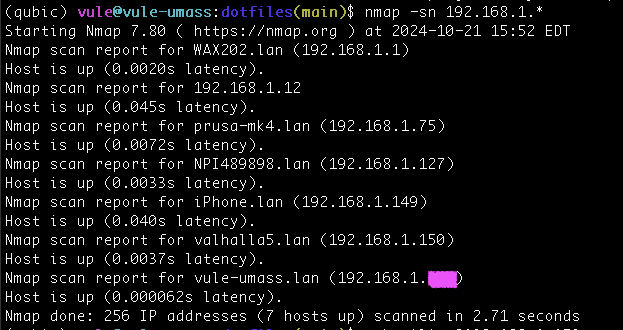

# qubic

Lawrence Berkeley National Laboratory's quantum control systems Qubic2.0 reproduction. Scripts for quick hardware synthesis, software installation, tutorials and so on.

# Prerequisites

Before building and running this system, you have to install Vivado, drivers for your ZCU216 board.

## Installing Vivado

<details>
  <summary>Click to expand</summary>
First, you have to install Vivado Enterprise so that it supports all IP cores needed for the gateware synthesis. If you're installing Vivado Enterprise with batch mode (using terminal on a remote server), you might follow my instructions to save time reading from AMD.

- Register and Download [the Unified Vivado version 2022.1](!https://www.xilinx.com/member/forms/download/xef.html?filename=Xilinx_Unified_2022.1_0420_0327_Lin64.bin) from ADM. Then run this command to extract the `xsetup` for Vivado:

```bash
chmod +x ./Xilinx_Unified_2022.1_0420_0327_Lin64.bin
./Xilinx_Unified_2022.1_0420_0327_Lin64.bin  --keep --noexec --target ~/tools/Xilinx
```

If you want to install Vivado on the root folder so that other users in a single server can use, you should install it to the `/tools` folder:

```bash
sudo ./Xilinx_Unified_2022.1_0420_0327_Lin64.bin  --keep --noexec --target /tools/Xilinx
```

For my case, I installed it in my home folder, which is `~/tools/Xilinx`

Ater the extraction has finished, navigate to `~/tools/Xilinx` and run authentication & configuration setups as well accepting agreement for final installation.

```bash
cd ~/tools/Xilinx
./xsetup -b AuthTokenGen  # put your AMD email and password there
```

Now, you have to obtain a configuration file and edit it. Run the `./xsetup -b ConfigGen` command, then choose 2 (Vivado), followed by 2 (Vivado ML Enterprise). A configuration file will be then generated at ~/.Xilinx/install_config.txt, go and edit the Destination to your local folder (Destination=/home/your_username/tools/Xilinx).

Finally, run this command and wait for the installation to finish:

```bash
./xsetup -b Install -a XilinxEULA,3rdPartyEULA -c ~/.Xilinx/install_config.txt
```

If you want to remove your current Vivado version and install another version, make sure to remove the installed Xilinx location, `~/.Xilinx`, and also the following config:
```bash
rm ~/.config/menus/applications-merged/Xilinx\ Design\ Tools.menu
```
## Installing drivers for peripherals on Linux

By default, it seems that JTAG cable can't be detected by vivado. If you connect an FPGA board and a JTAG cable to upload bitstream fils to the board, the cable may not be detected.

First, open Vivado in tcl mode by running `vivado -mode tcl` in the bash terminal, make sure the jtag cable (usb-micro-usb) is connected to the host computer (`lsusb` to check), then execute these commands in `Vivado TCL shell` to check if JTAG is detected by Vivado:

```tcl
open_hw_manager
connect_hw_server
get_hw_targets
```

If it outputs something like this:

```tcl
Vivado% get_hw_targets
ERROR: [Labtoolstcl 44-199] No matching targets found on connected servers: localhost
Resolution: If needed connect the desired target to a server and use command refresh_hw_server. Then rerun the get_hw_targets command.
ERROR: [Common 17-39] 'get_hw_targets' failed due to earlier errors.
Vivado% refresh_hw_server
WARNING: [Labtoolstcl 44-27] No hardware targets exist on the server [localhost:3121]
Check to make sure the cable targets connected to this machine are properly connected
and powered up, then use the refresh_hw_server command to re-register the hardware targets.
Vivado% get_hw_targets
ERROR: [Labtoolstcl 44-199] No matching targets found on connected servers: localhost
Resolution: If needed connect the desired target to a server and use command refresh_hw_server. Then rerun the get_hw_targets command.
ERROR: [Common 17-39] 'get_hw_targets' failed due to earlier errors.
Vivado% disconnect_hw_server
Vivado% connect_hw_server
```

Chances are drivers are not installed by default, to install drivers, you have to navigate to the `install_drivers` folder and run the installation script:

```bash
cd ~/tools/Xilinx/Vivado/2022.1/data/xicom/cable_drivers/lin64/install_script/install_drivers
sudo ./install_drivers
./setup_pcusb
```

Now if you run the TCL commands for checking JTAG, you should be able to see it in Vivado:

```tcl
Vivado% refresh_hw_server
WARNING: [Labtoolstcl 44-27] No hardware targets exist on the server [localhost:3121]
Check to make sure the cable targets connected to this machine are properly connected
and powered up, then use the refresh_hw_server command to re-register the hardware targets.
Vivado% disconnect_hw_server
Vivado% connect_hw_server
INFO: [Labtools 27-2285] Connecting to hw_server url TCP:localhost:3121
INFO: [Labtools 27-3415] Connecting to cs_server url TCP:localhost:3042
INFO: [Labtools 27-3414] Connected to existing cs_server.
localhost:3121
Vivado% get_hw_targets
localhost:3121/xilinx_tcf/Xilinx/96234996810A
Vivado%
```

</details>

## Running Linux on ZCU216

<details>
  <summary>Click to expand</summary>

### Via UART

First, you need to download a boot image to run Linux on the ARM core in the board. You can use the image from Berkeley Lab here. After having the SD card booted and inserted to the board, you have to change the J71 switch to 0001 to switch to SD boot mode to run the image. Then turn on the power button, connect the J11 UART port to a host computer and also connect the board to a router in the same network as the host computer. Initially you don't know the IP address of the Xilinx board, but you can use this command on the host computer to access the board via UART. But first, you have to reset the device path to reset the device’s parameters to a 'sane' default state. Open the terminal in the host computer and run:

```bash
sudo stty -F /dev/ttyUSB1 sane  # ttyUSB1 is the port.

# Clear any pending data (optional)
sudo cat /dev/ttyUSB1 > /dev/null &

sudo screen /dev/ttyUSB1 115200  # to connect to the board
ip a  # to find the IP4 address, which is used for ssh
```

You can also run:

```bash
sudo stty -F /dev/ttyUSB1 -a  # to check the baudrate
```

### Via IP4 (recommended)

Alternatively, you can also use `nmap` in the host computer to search for the IP address of the Xilinx board and ssh into the board. This is the recommended way because it's more stable than the UART method. First, determine the range of addresses in your private network. You can do this by indentifing your host computer address with `ip a | grep 192`. For example, your host computer IP4 address is `192.168.1.239`, then the range of address for looking up is `192.168.1.*`, open terminal and run:

```bash
sudo apt-get install nmap
nmap -sn 192.168.1.*
```

You should be able see the xilinx board `Nmap scan report for valhalla5.lan (192.168.1.150)` as shown in the screenshot there



Then you can ssh into it, the default username and password is `xilinx`

</details>

## Hardware synthesis

<details>
  <summary>Click to expand</summary>

To build gateware (Qubit Controller), you can simply run the [build_zcu216_gateware.sh](build_zcu216_gateware.sh). This script will automatically ask you if you want to build the gateware with the lastest version, or the current version in the repo.

```bash
bash scripts/build_zcu216_gateware.sh
```

After succesfully building the gateware, it will ask you if you want to upload that `psbd.bit` file to the FPGA board.

Also, in case you have multiple gateware built with different version and you want to test with different one. You can simply run the [upload_bitstream_fpga.sh](./scripts/upload_bitstream_fpga.sh). By default, it will loop through the [gateware folder](./gateware/) and list all available `psbd.bit` version for you to choose to upload to the ZCU216.

```bash
bash ./scripts/upload_bitstream_fpga.sh
```

You can also pass a bitstream file to this file to upload to the FPGA.

```bash
bash ./scripts/upload_bitstream_fpga.sh MY_BISTREAM_FILE_LOCATION
```

</details>

## System software installation

<details>
  <summary>Click to expand</summary>
For Qubic2.0 to work correctly, you must both install correct libraries provided by Berkeley Lab on both the host and the FPGA gateware. We recommend you to install Anaconda on the host computer and have an isolated environment for qubic gateware. You can achieve all of these by simply run [the software installation script](./scripts/install_qubic_software.sh). On the host machine:

```bash
bash ./scripts/install_qubic_software.sh host
```

On the ZCU216 board:

```bash
git clone --recursive https://github.com/vule20/qubic2.0-qubit-controller.git
```

On parent folder of this repository on the client (ZCU216 FPGA), simply run:

```bash
bash ./scripts/install_qubic_software.sh client
```

After you go through all of these steps, you are ready to use this system.

</details>

# Contact

- [LinkedIn: Anthony Vule](https://www.linkedin.com/in/anthony-vule/)
- [Personal Email](mailto:vule20.cs@gmail.com)
- [UMass Email](mailto:vdle@umass.edu)
- [Berkeley Lab Email](mailto:vule@lbl.gov)
